# Story-Generation-NLP
 Generating following context using LSTM and GPT-2

 

## Abstract

Automatic Story Generation Intelligent systems through machine learning models take the input data set as the beginning of the story and generate follow-up fictional stories. The intelligent system needs to have a large and deep knowledge to tell a coherent story, so story generation can understand whether the intelligent system really understands the concept of one thing. Through the story telling, we can understand the understanding degree of the intelligent system to the concept of a certain event, and from the details of the story telling, we can find out whether the intelligent system really understands the concept of things.

 

## Background

The capabilities of neural networks for text processing have improved dramatically over the past few years, and the literature on neural network-based story generation techniques is growing rapidly. A language model (LM) learns the probabilities of token sequences based on the history of previously occurring tokens, and is trained on a specific text corpus to generate story text by sampling from the language model. Training a language model on a corpus of stories means that the language model will learn on top of the corpus, so sampling from this language model will tend to produce text that looks like a story.

The field of automatic story generation has gone through many phase transitions, from non-learning story generation systems to machine learning based story generation systems (especially neural networks). Symbolic story generation systems are capable of generating fairly long and coherent stories, and most of the power of these systems comes from well-structured knowledge bases, but these knowledge bases must be constructed manually, which limits what the system can generate. The neural network has the ability to acquire and utilize knowledge from the corpus, and the story generation system constructed can generate a wider range of story space and involve a wider range of topics, but it also ignores the coherence of the story.

 

## Problem Description

Originally proposed in 2017 by Roemelle and Gordon et al. [1], and Khalifa et al. [2] to explore text generation techniques using recurrent neural networks such as LSTM and GRU. If the story training corpus is too diverse, RNN-based language models will struggle to generate sequences that don't look too random. The sparsity of the training corpus makes each story unique before each other, and the uniqueness of the sentences and events in the stories makes it difficult to train a story-based learning language model.

In order to solve the above problems, Martin et al. [3] proposed the concept of converting stories from natural language to event tuples in 2018 to reduce the sparsity of the story corpus. A tuple can be represented as $e = < s, v, o, p, m >$, where $s$ is the subject, $v$ is the verb, $o$ is the object, $p$ is the preposition, and $m$ is the appended noun accompanying the preposition. 

To give an example of an English sentence, "Kevin continuously wipe his dirty table in the classroom" would be represented as the tuple <Kevin, wipe, table, in, classroom>, and be followed by a semantic part of speech from WordNet or a semantic class from VerbNet Verb frame classes to replace and generalize these terms in one step, e.g. $< person − 1, clean − 2.4, furniture. 2, area. 5 >$.

The above theory reduces the sparsity of the story corpus to a certain extent, and can learn and generate better event sequences than when processing the original text. However, the above theory faces the situation that event tuples are difficult to read, so a second neural network is subsequently introduced to convert event tuples back to complete sentences. The "eventization" of sentences (i.e., the process of converting them into tuples) is a lossy process, so the task of this neural network is to recover sentence information in a contextual way, which is equivalent to retelling an abstract story in natural language.

 

## Solutions

A major limitation of neural language models is that subsequent tokens are generated from a sequence of previous tokens in a backward rather than forward direction, so there is no guarantee that using a neural network will produce coherent text or text that matches the target topic. As the number of sentences in the story grows, most of the previous context has been forgotten, making the neural language model-based story generation system an illogical storyteller, and stories often give people a sense of stream of consciousness. 

Large-scale pre-training converters such as GPT-2, GPT-3, and BART help solve the above-mentioned lack of logical awareness by taking a larger context window, but they can only solve part of the logical problem and cannot fully ensure that the story is in the right direction. target topics.

Tambwekar et al. [4] proposed the use of reinforcement learning to fine-tune a sequence-to-sequence language model to ensure that subsequent generated stories continue toward a given target topic. Reinforcement learning can be used to solve sequence-type problem decisions, but the latent space of language models is too large for true trial-and-error learning, so reinforcement learners are used as non-differentiable loss functions. The system extracts verb patterns from the story corpus and clusters each verb based on its distance from the target topic, and then when the verb continuation produced by the language model in the next cluster is closer to the target topic, it The language model is rewarded to judge how well the model matches the target topic.

Neural language models are trained on language rather than in a limited symbol space, so they are somewhat robust to very large input and output spaces. Story generation based on neural language models reduces the coherence of stories, while symbolic systems perform well in terms of coherence through logical and graphical constraints, but their biggest drawback is limited symbolic space. 

Lara Martin [5] proposed the GPT-2 neural language model and constrained it by causal inference. GPT-2 acts as a language model that can probabilistically generate story continuations based on historical word tokens. The system parses continuation sentences and uses VerbNet to infer sentence preconditions and subsequent outputs. If the topic of the subsequent output in the story does not meet the precondition, the output is rejected; otherwise, the output is used to update the logical preposition.

 

## GPT-2

In early 2019, OpenAI proposed GPT-2 (Generative Pretrained Transformer 2), a huge pre-trained model (1.5 billion parameters), which is a Transformer-based model that uses an attention mechanism, so it can generate human-like quality text. GPT-2 produces decent quality text before fine-tuning, but even better after fine-tuning. In order to use GPT-2 on the data, the data needs to be tokenized, that is, all sentences are divided into words, and imported into the pre-trained GPT-2 model and tokenizer (GPT-2 Tokenizer). Since the GPT-2 model is very large, there is a high probability that it will encounter a CUDA insufficient memory error when running it on a computer.

The above problems can be solved by means of parameter adjustment or hardware. First, the gradient descent step can be optimized by using gradient accumulation. This algorithm sums the gradients of several operations and divides the total by the number of accumulation steps to obtain the average loss of the training samples, thereby reducing the calculation when training the model. quantity. For the hardware method, this experiment uses the GPU on the Google Colab platform to fine-tune and train the GPT-2 model.

Model we used: ***DistilGPT2***.

DistilGPT2 is an English-based language model pretrained under the supervision of a minimal version of GPT-2 for text generation. The DistilGPT2 model, developed by HuggingFace, is a Transformer-based English pre-trained language model. Unlike GPT-2's huge model with hundreds of millions of parameters, DistilGPT2 has only 82 million parameters and was developed using knowledge distillation. It is a faster and lighter model version than GPT-2.

The model hyperparameters are set as follows: ***number of iterations=5, batch size=8, learning rate=0.0001, warm-up learning step=100, optimizer=Adam***. The model then defines a ***scheduler*** to vary the learning rate over time during training and uses an ***FP16 scaler*** to speed up training. FP16 can reduce the memory occupied by network training, and keep the accuracy of the trained model equal, which belongs to the mixed precision training method. After forward propagation during training, use the loss function to do backpropagation, zero the gradients and cumulative gradients in the optimizer after each batch, and let FP16 perform the scheduling.

 

## Algorithm Flowchart of LSTM

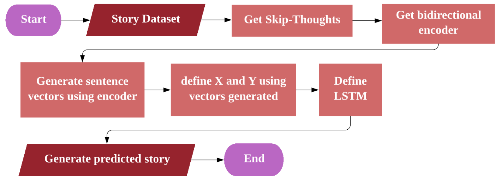

 

## Algorithm Flowchart of GPT-2

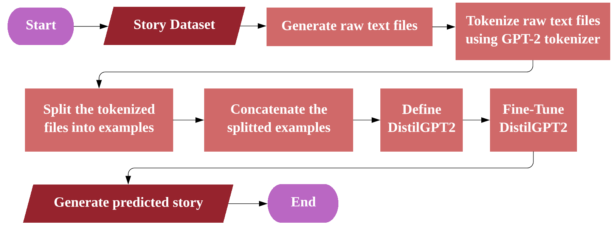

 

## Experiment environment

Environment 1: Visual Studio Code 1.74.1 + Python 3.7.7

Environment 2: Google Colab Pro + Python 3.8.16 + Premium GPU

Dataset: ROCStories Dataset

 

## Result

|                             LSTM                             |                       Fine Tune GPT-2                        |
| :----------------------------------------------------------: | :----------------------------------------------------------: |
| 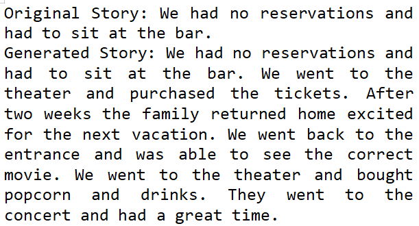 | 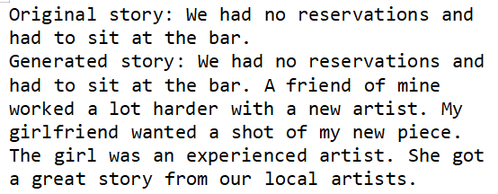 |
| 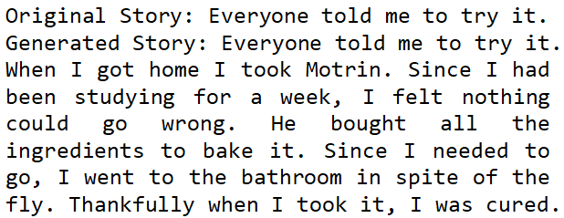 | 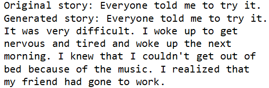 |
| 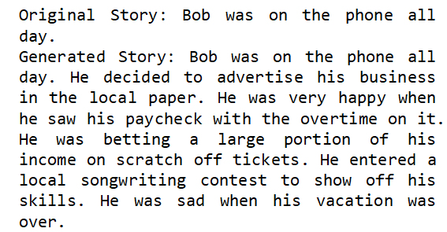 | 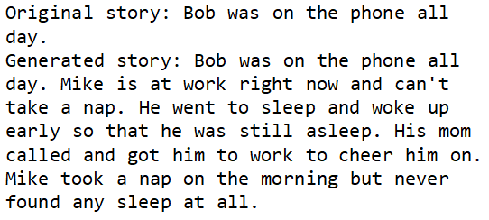 |
| 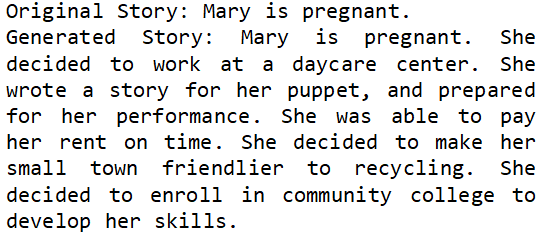 | 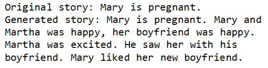 |
| 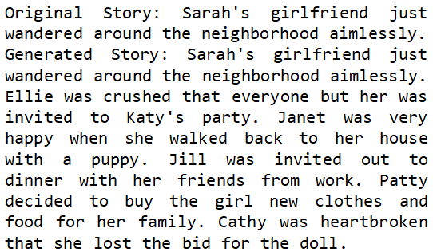 | 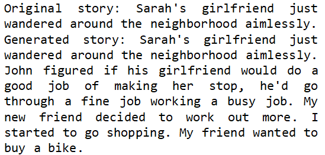 |

 

As shown in table above, it can be observed that on the basis of the same example, the output text of the story generation based on LSTM and fine-tuning GPT-2 shows different logic. Compared with LSTM, the sentence generated by the fine-tuned GPT-2 model is more coherent in logic. This is due to the fact that the number of parameters trained by the latter far exceeds that of the former, so the results obtained are relatively more accurate.

 On the other hand, by introducing a scheduler to vary the learning rate during training over time and using an FP16 scaler to optimize training, the fine-tuned GPT-2 achieves better sentence logic judgment accuracy than before. The GPT-2 model uses reinforcement learning for fine-tuning to ensure that the subsequent generated stories continue toward a given target topic. It is proposed to improve the problem of lack of logical sentences generated by recurrent neural networks (such as LSTM or GRU, etc.).

 

## Conclusion

Under the fine-tuned GPT-2 model, the natural language generation task is more efficient, and the accuracy and model performance have also been improved. For recurrent neural networks, context is mostly forgotten, making neural language model-based story generation systems illogical; large pre-trained transformers such as GPT-2 help address the above lack of logic by taking a larger context window , making the generated new chapters look more human.

 

#### *References:*

[1] Roemmele, M., & Gordon, A.S. (2018). Automated Assistance for Creative Writing with an RNN Language Model. *Proceedings of the 23rd* *International Conference on Intelligent User Interfaces Companion*. 

[2] Khalifa, Ahmed et al. “DeepTingle.” *International Conference on Innovative Computing and Cloud Computing* (2017). 

[3] Martin, Lara J. and Ammanabrolu, Prithviraj and Wang, Xinyu and Hancock, William and Singh, Shruti and Harrison, Brent and Riedl, Mark O. (2017). Event Representations for Automated Story Generation with Deep Neural Nets. *Computation and Language (cs.CL).* https://arxiv.org/abs/1706.01331. 

[4] Pradyumna Tambwekar and Murtaza Dhuliawala and Lara J. Martin and Animesh Mehta and Brent Harrison and Mark O. Riedl. (2019). Controllable Neural Story Plot Generation via Reward Shaping. *Proceedings of the Twenty-Eighth International Joint Conference on* *Artificial Intelligence*. https://doi.org/10.24963%2Fijcai.2019%2F829. 

[5] Lara Jean Martin. (2021). Neurosymbolic automated story generation. *College of Computing Theses and Dissertations*. http://hdl.handle.net/1853/64643. 

[6] Zhiyong Cui, Ruimin Ke, Ziyuan Pu, Yinhai Wang. Stacked Bidirectional and Unidirectional LSTM Recurrent Neural Network for Network-wide Traffic Speed Prediction[J]. *https://arxiv.org/ftp/arxiv/papers/1801/1801.02143.pdf*. 

[7] SkipThoughts - Recurrent neural network sentence-to-vector encoder. *https://modelzoo.co/model/skipthoughts*. 

[8] Hugging Face GPT-2. *https://huggingface.co/gpt2*.
